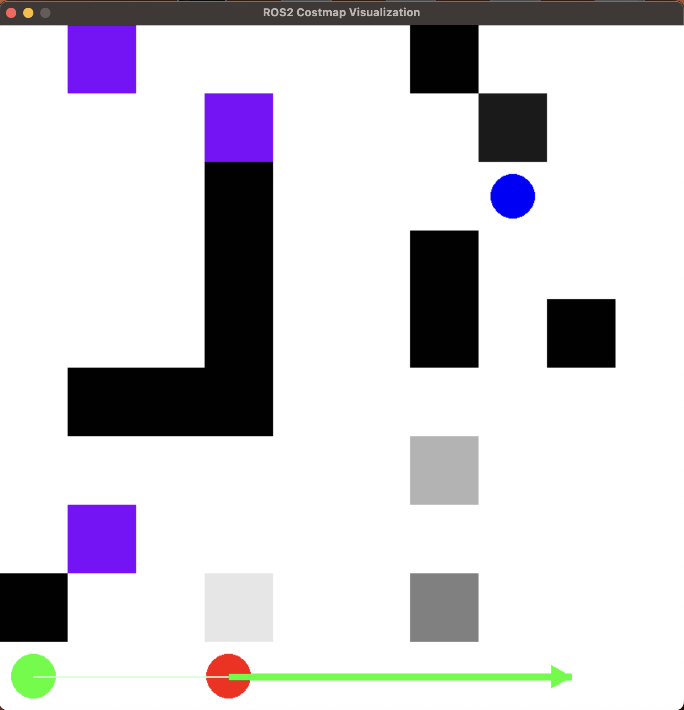

# `nav_visualization` Package Documentation

## 1. Overview

The `nav_visualization` package provides ROS 2 nodes and utilities for visualizing robot navigation tasks within a 2D grid-based environment. It is designed to work closely with the `nav_infrastructure` package, which handles the core planning and control logic using plugins defined in `nav_plugins`.

This package allows users to:

*   **Visualize Costmaps:** Load and display grid maps representing the environment's costs and obstacles.
*   **Visualize Path Planning:** Display the global path calculated by a planner (like those used by `nav_infrastructure`'s `planner_server`).
*   **Visualize Local Planning/Control:** Show the robot's real-time movement, orientation, and trajectory as it follows a path, typically driven by command velocities (`Twist` messages) generated by a controller (like those used by `nav_infrastructure`'s `controller_server`).
*   **Create Costmaps:** Use an interactive tool to draw and save custom costmaps.
*   **Run Standalone Demos:** Utilize dummy publishers to simulate robot motion for testing visualization components independently.

## 2. Dependencies

*   **ROS 2:** Humble or later (specifically `rclpy`, `launch`, `launch_ros`, `geometry_msgs`, `nav_msgs`, `std_msgs`, `ament_index_python`).
*   **Python Libraries:** `pygame` (for visualization), `numpy` (for grid manipulation), `os`, `sys`, `math`, `threading`, `pyautogui` (for `draw_costmap.py`), `scipy` (for `lp_vis.py` orientation calculations). See `requirements.txt` for specific versions tested.
*   **Related Custom Packages:**
    *   `nav_infrastructure`: Provides the core planning (`planner_server`) and control (`controller_server`) action servers. `nav_visualization` often connects to these servers or subscribes to topics published by them.
    *   `nav_plugins`: Contains the actual planning and control algorithms loaded by `nav_infrastructure`.
    *   `infra_interfaces`: Defines custom message and action types used by `nav_infrastructure` and consumed by `nav_visualization` (e.g., `NavigateToGoal.action`, `FollowPath.action`, `CellCoordinateMsg.msg`).

## 3. Installation

1.  **Clone Repositories:** Ensure `nav_visualization`, `nav_infrastructure`, and `nav_plugins` are cloned into the `src` directory of your ROS 2 workspace.
    ```bash
    cd <your_ros2_ws>/src
    git clone https://github.com/umigv/nav_visualization
    git clone https://github.com/umigv/nav_infrastructure
    git clone https://github.com/umigv/nav_plugins
    ```
2.  **Install Dependencies:** Install Python dependencies.
    ```bash
    cd <your_ros2_ws>/src/nav_visualization
    pip install -r requirements.txt
    # Make sure pygame dependencies are met (e.g., SDL libraries)
    # sudo apt-get install libsdl2-dev libsdl2-image-dev libsdl2-mixer-dev libsdl2-ttf-dev (Debian/Ubuntu example)
    ```
3.  **Build Packages:** Build the necessary packages using colcon.
    ```bash
    cd <your_ros2_ws>
    colcon build --packages-select nav_visualization nav_infrastructure nav_plugins infra_interfaces
    ```
4.  **Source Workspace:** Source the overlay workspace.
    ```bash
    source install/setup.bash # or setup.zsh
    ```

## 4. Costmap File Format (`.txt`)

The visualization tools rely on text files to define the environment:

*   **Line 1:** Start coordinates `X Y` (integer grid cell indices).
*   **Line 2:** Goal coordinates `X Y` (integer grid cell indices).
*   **Remaining Lines:** Grid cell data, row by row. Each number represents the cost of a cell.
    *   `0`: Free space (lowest cost).
    *   `1`-`99`: Intermediate costs.
    *   `100`: Obstacle or high-cost area (often treated as impassable by planners).
    *   `-1`: Unknown space.

**Important Coordinate Note:** The costmap file represents the grid with (0,0) at the top-left. However, the visualization nodes (`pp_vis`, `lp_vis`) typically **flip the y-axis** during rendering, so the visualized map has (0,0) at the **bottom-left**, aligning with common ROS coordinate conventions (like `map` frame). The start/goal coordinates in the file should correspond to the *file's* coordinate system (top-left origin).

**Example (`costmap3.txt`):**

```
0 0         # Start at (0,0) in the file's top-left system
7 7         # Goal at (7,7) in the file's top-left system
0 -1 0 0 0 0 100 0 0 0   # Row 0
0 0 0 -1 0 0 0 90 0 0   # Row 1
... (rest of the 10x10 grid)
0 0 0 0 0 0 0 0 0 0   # Row 9
```

## 5. Core Visualization Scripts

These scripts are the primary entry points for visualization, typically run via launch files. They are installed as executables via `setup.py`.

### 5.1. `pp_vis.py` (Executable: `pp_vis`)

*   **Purpose:** Visualizes the **global path planning** process. It sends a goal to the `NavigateToGoal` action server (provided by `nav_infrastructure`'s `planner_server`) and displays the resulting path and robot's progress based on action feedback.
*   **How it Works:**
    1.  Initializes `rclpy` and `pygame`.
    2.  Loads parameters (costmap file, window dimensions) typically from `pp_vis_params.yaml` via `pp_vis.launch.py`.
    3.  Reads the specified costmap file.
    4.  Creates an `ActionClient` for `/navigate_to_goal`.
    5.  Constructs a `NavigateToGoal.Goal` message containing start, goal, and the costmap (converted to `nav_msgs/OccupancyGrid`).
    6.  Sends the goal to the action server.
    7.  In the `feedback_callback`: Receives the robot's current position (as `distance_from_start` within the feedback) and updates the visualization.
    8.  Draws the costmap (y-axis flipped), start/goal points, and the robot's path history using `pygame`.
*   **Parameters (Set via `pp_vis_params.yaml` or launch args):**
    *   `costmap_file` (string): Name of the costmap file within the `costmaps` directory.
    *   `window_height` (int): Desired height of the visualization window.
    *   `window_width` (int): Desired width of the visualization window.
*   **Typical Usage:** Run alongside `nav_infrastructure`'s `planner_server` node. Launch using `pp_vis.launch.py`.

### 5.2. `lp_vis.py` (Executable: `lp_vis`)

*   **Purpose:** Visualizes the **local planning and control** process. It simulates or displays the robot's continuous movement based on `geometry_msgs/Twist` commands, typically published by `nav_infrastructure`'s `controller_server`. It also publishes simulated `nav_msgs/Odometry`.
*   **How it Works:**
    1.  Initializes `rclpy` and `pygame`.
    2.  Loads parameters (costmap file, window dimensions, topic names) typically from `lp_vis_params.yaml` via `lp_vis.launch.py`.
    3.  Reads the specified costmap file. Sets the *initial* robot pose from the start coordinates in the file.
    4.  Creates a `Subscription` to the specified `twist_topic` (`/cmd_vel` by default).
    5.  Creates a `Publisher` for the specified `odom_topic` (`/odom` by default).
    6.  **(Optional but typical use case):** Creates an `ActionClient` for `/navigate_to_goal` to *trigger* the full navigation stack in `nav_infrastructure` (which eventually causes the controller to publish Twist commands). Sends the goal based on the costmap file.
    7.  In the `twist_callback`: Stores the latest received `Twist` message.
    8.  In a periodic `visualization_loop` (timer):
        *   Updates the robot's pose (`x`, `y`, `theta`) based on the last received `Twist` message and a small time step (`DELTA_TIME`).
        *   Publishes the calculated `Odometry` message.
        *   Draws the costmap (y-axis flipped), start/goal points, the robot's current position (circle), its path history (line), and an arrow indicating its current orientation and speed.
*   **Parameters (Set via `lp_vis_params.yaml` or launch args):**
    *   `costmap_file` (string): Name of the costmap file.
    *   `window_height` (int): Window height.
    *   `window_width` (int): Window width.
    *   `twist_topic` (string): Topic to subscribe to for `geometry_msgs/Twist` messages (e.g., `/cmd_vel`).
    *   `odom_topic` (string): Topic to publish `nav_msgs/Odometry` messages to (e.g., `/odom`).
*   **Typical Usage:** Run alongside the full `nav_infrastructure` stack launched via `infra.launch.py`. This launch file starts both the planner and controller servers. The controller server subscribes to `/odom` (published by `lp_vis`) and publishes to `/cmd_vel` (subscribed to by `lp_vis`). Launch the visualizer using `lp_vis.launch.py`.

## 6. Utility Scripts

### 6.1. `draw_costmap.py` (Run directly: `python3 draw_costmap.py`)

*   **Purpose:** Provides an interactive `pygame` window to create or edit costmap files.
*   **Usage:**
    1.  Run `python3 src/nav_visualization/nav_visualization/draw_costmap.py` from your workspace root.
    2.  Follow the terminal prompts to enter grid dimensions, start/goal coordinates, and a filename (e.g., `my_costmap.txt`).
    3.  A window appears. Left-click to draw obstacles (cost 100, black). Click again on an obstacle to erase it (cost 0, white).
    4.  Close the window. The costmap will be saved to `<your_ros2_ws>/src/nav_visualization/costmaps/your_filename.txt`.

### 6.2. `dummy_position_publisher.py` (Executable: `dummy_position_publisher`)

*   **Purpose:** Simulates the feedback of a path planner by publishing `geometry_msgs/Point` messages representing the robot's position on a topic (default: `/robot_position`).
*   **How it Works:** Reads a costmap file to get dimensions, starts near the center, and publishes slightly randomized positions within the grid boundaries at a fixed rate.
*   **Parameters:** `costmap_file`, `update_rate`, `topic`.
*   **Usage:** Used in the `dummy-demo-pp.py` launch file for testing `pp_vis.py` without needing the actual `planner_server`.

### 6.3. `dummy_twist_publisher.py` (Executable: `dummy_twist_publisher`)

*   **Purpose:** Simulates the output of a controller by publishing `geometry_msgs/Twist` messages with smoothly varying linear and angular velocities using sine/cosine functions.
*   **How it Works:** Publishes `Twist` messages to a specified topic (default: `/robot_twist`) at a fixed rate.
*   **Parameters:** `topic`, `update_rate`.
*   **Usage:** Used in the `dummy-demo-lp.py` launch file for testing `lp_vis.py` without needing the actual `controller_server`.

## 7. Launch Files

Located in the `launch/` directory and installed to `share/nav_visualization/launch`.

*   **`pp_vis.launch.py`:**
    *   **Purpose:** Launches only the **path planning visualizer node** (`pp_vis`).
    *   **Configuration:** Loads parameters from `config/pp_vis_params.yaml`.
    *   **Usage:** Typically run alongside a separate launch of the `planner_server` node from `nav_infrastructure`.
        ```bash
        # Terminal 1: Launch planner server (example)
        ros2 launch planner_server planner_server.launch.py # (Assuming configured params)
        # Terminal 2: Launch PP visualizer
        ros2 launch nav_visualization pp_vis.launch.py
        # Optionally override parameters:
        # ros2 launch nav_visualization pp_vis.launch.py costmap_file:=costmap4.txt
        ```

*   **`lp_vis.launch.py`:**
    *   **Purpose:** Launches only the **local planning visualizer node** (`lp_vis`).
    *   **Configuration:** Loads parameters from `config/lp_vis_params.yaml`.
    *   **Usage:** Typically run alongside a separate launch of the full `nav_infrastructure` stack (`infra.launch.py`).
        ```bash
        # Terminal 1: Launch full infrastructure
        ros2 launch infra_launch infra.launch.py # (Assuming configured params)
        # Terminal 2: Launch LP visualizer
        ros2 launch nav_visualization lp_vis.launch.py
        # Optionally override parameters:
        # ros2 launch nav_visualization lp_vis.launch.py costmap_file:=costmap4.txt twist_topic:=/diff_cont/cmd_vel_unstamped
        ```

*   **`dummy-demo-pp.py`:**
    *   **Purpose:** Demonstrates the path planning visualizer using simulated data.
    *   **Launches:**
        *   `pp_vis` node (`path_planning_visualizer`).
        *   `dummy_position_publisher` node.
    *   **Parameters:** Accepts `costmap_file`, `window_height`, `window_width` arguments (passed to the nodes).
    *   **Usage:** Standalone demo for `pp_vis`.
        ```bash
        ros2 launch nav_visualization dummy-demo-pp.py costmap_file:=costmap3.txt
        ```
    *   *Note:* This demo doesn't use the action server, so the visualization won't directly reflect action feedback. It relies on the dummy publisher's topic, which `pp_vis` isn't configured to subscribe to by default. This launch file might need adjustment to correctly link the dummy publisher output to the visualizer if intended for direct visualization based on the dummy data. (The current `pp_vis` relies solely on action feedback).

*   **`dummy-demo-lp.py`:**
    *   **Purpose:** Demonstrates the local planning visualizer using simulated `Twist` data.
    *   **Launches:**
        *   `lp_vis` node (`local_planning_visualizer`).
        *   `dummy_twist_publisher` node.
    *   **Parameters:** Accepts `costmap_file`, `window_height`, `window_width`, `topic` arguments (passed to the nodes, `topic` sets both the publisher's output and subscriber's input).
    *   **Usage:** Standalone demo for `lp_vis`.
        ```bash
        ros2 launch nav_visualization dummy-demo-lp.py costmap_file:=costmap3.txt topic:=/robot_twist
        ```

*   **`server-demo-pp.py`:**
    *   **Purpose:** Launches the path planning visualizer *and* a `planner_server` node together for a combined demo.
    *   **Launches:**
        *   `pp_vis` node (`path_planning_visualizer`).
        *   `planner_server` node (from `planner_server` package - **this assumes the `planner_server` package exists and is built**). *Correction: The file description implies `planner_server` is from a package named `planner_server`, which aligns with `nav_infrastructure`'s structure.*
    *   **Parameters:** Accepts `costmap_file`, `window_height`, `window_width`. Hardcodes `planner_plugin` and `odom_topic` for the `planner_server`.
    *   **Usage:** Integrated demo of path planning visualization with a planner.
        ```bash
        # Make sure nav_infrastructure and its dependencies are built
        ros2 launch nav_visualization server-demo-pp.py costmap_file:=costmap3.txt
        ```
    *   *Note:* This launch file might need the `planner_server` package to be explicitly declared as a dependency in `nav_visualization`'s `package.xml` if it's intended to be launched this way reliably. The hardcoded `planner_plugin` name "ExamplePathPlannerPlugin" needs to exist and be valid.

## 8. Configuration Files (`config/`)

These files provide default parameters for the main visualization nodes when launched via `pp_vis.launch.py` and `lp_vis.launch.py`.

*   **`pp_vis_params.yaml`:**
    ```yaml
    path_planning_visualizer: # Node name
      ros__parameters:
        costmap_file: "costmap3.txt"
        window_height: 800
        window_width: 800
    ```

*   **`lp_vis_params.yaml`:**
    ```yaml
    local_planning_visualizer: # Node name
      ros__parameters:
        costmap_file: "costmap3.txt"
        window_height: 800
        window_width: 800
        twist_topic: "/cmd_vel" # Topic for receiving Twist commands
        odom_topic: "/odom"    # Topic for publishing Odometry
    ```

## 9. Example Usage Scenario: Full Stack Visualization

This demonstrates visualizing the entire navigation process using `nav_infrastructure` and `nav_visualization`.

1.  **Ensure Prerequisites:** All packages (`nav_visualization`, `nav_infrastructure`, `nav_plugins`, `infra_interfaces`) are built and the workspace is sourced.
2.  **Configure `nav_infrastructure`:** Edit `nav_infrastructure/infra_launch/config/infra_params.yaml` to select desired planner and controller plugins (e.g., `bfs_planner`, `pure_pursuit_controller`) and ensure `cmd_vel_topic` is `/cmd_vel` and `odom_topic` is `/odom`. Set `isolate_path_planner` to `false`.
3.  **Terminal 1: Launch Infrastructure:**
    ```bash
    ros2 launch infra_launch infra.launch.py
    ```
    This starts the `planner_server` and `controller_server`.
4.  **Terminal 2: Launch Visualization:** Launch the local planning visualizer, configuring it to use the desired costmap.
    ```bash
    # Use the costmap defined in lp_vis_params.yaml (default: costmap3.txt)
    ros2 launch nav_visualization lp_vis.launch.py

    # Or, specify a different costmap
    # ros2 launch nav_visualization lp_vis.launch.py costmap_file:=costmap4.txt
    ```
5.  **Observe:** The `lp_vis` window will open. It automatically sends a `NavigateToGoal` action request (using start/goal from the costmap file) to the `planner_server` running in Terminal 1. The planner calculates a path, sends it to the `controller_server` (via the `FollowPath` action called internally by the planner server when `isolate_path_planner` is false). The `controller_server` reads odometry from `/odom` (published by `lp_vis`) and publishes `/cmd_vel` messages. `lp_vis` subscribes to `/cmd_vel`, updates its internal pose, draws the robot's movement, and publishes `/odom`, closing the loop. You should see the red robot circle move along a green path from the start (green circle) to the goal (blue circle) on the visualized costmap.



---

## 10. TLDR: Quick Start Guide for Local Planning Visualization

This assumes you have ROS 2 Humble installed and configured.

1.  **Clone Repositories:**
    ```bash
    # Navigate to your ROS 2 workspace source directory
    cd <your_ros2_ws>/src

    # Clone the necessary repositories
    git clone https://github.com/umigv/nav_visualization
    git clone https://github.com/umigv/nav_infrastructure
    git clone https://github.com/umigv/nav_plugins
    ```

2.  **Install Dependencies:**
    ```bash
    # Navigate to the nav_visualization package
    cd <your_ros2_ws>/src/nav_visualization

    # Install Python requirements
    pip install -r requirements.txt

    # Install system dependencies for pygame (example for Debian/Ubuntu)
    sudo apt-get update
    sudo apt-get install -y python3-pygame libsdl2-dev libsdl2-image-dev libsdl2-mixer-dev libsdl2-ttf-dev
    ```

3.  **Build Packages:**
    ```bash
    # Navigate back to your workspace root
    cd <your_ros2_ws>

    # Build the packages
    colcon build --packages-select nav_visualization nav_infrastructure nav_plugins infra_interfaces
    ```

4.  **Configure Infrastructure Parameters:**
    *   Edit the file: `<your_ros2_ws>/src/nav_infrastructure/infra_launch/config/infra_params.yaml`
    *   Set `planner_plugin`: e.g., `"planner_plugins::BFSPlanner"`
    *   Set `controller_plugin`: e.g., `"controller_plugins::PurePursuitController"`
    *   Ensure `cmd_vel_topic` is `/cmd_vel` (or matches `lp_vis_params.yaml`).
    *   Ensure `odom_topic` is `/odom` (or matches `lp_vis_params.yaml`).
    *   Set `isolate_path_planner: false`.

5.  **(Optional) Configure Visualization Costmap:**
    *   To use a custom costmap:
        *   Create it using `python3 <your_ros2_ws>/src/nav_visualization/nav_visualization/draw_costmap.py`.
        *   Edit `<your_ros2_ws>/src/nav_visualization/config/lp_vis_params.yaml` and change `costmap_file` to your new filename (e.g., `"my_costmap.txt"`). Rebuild if you change config files (`colcon build --packages-select nav_visualization`).
    *   Otherwise, the default `costmap3.txt` specified in `lp_vis_params.yaml` will be used.

6.  **Launch Infrastructure (Terminal 1):**
    ```bash
    # Navigate to your workspace root
    cd <your_ros2_ws>

    # Source the setup file
    source install/setup.bash

    # Launch the infrastructure
    ros2 launch infra_launch infra.launch.py
    ```

7.  **Launch Local Planning Visualization (Terminal 2):**
    ```bash
    # Navigate to your workspace root
    cd <your_ros2_ws>

    # Source the setup file
    source install/setup.bash

    # Launch the LP visualizer
    ros2 launch nav_visualization lp_vis.launch.py

    # --- OR --- if you want to override the costmap specified in the params file:
    # ros2 launch nav_visualization lp_vis.launch.py costmap_file:=your_other_costmap.txt
    ```

8.  **Observe:** The visualization window should appear and automatically trigger the navigation process defined by the start/goal in the loaded costmap file. You should see the simulated robot navigate the environment.